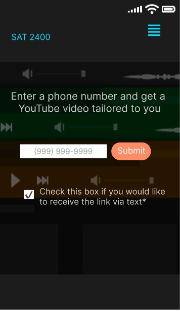
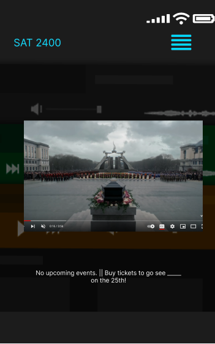

# Numbers to Notes (📱➡️🎶)

What's something we can agree on? For us, that'll be music. And we figured, most other people like music as well. We created this app with the idea that phone numbers are mostly uniqure, and so if we take a phone number and make some magic happen in the background, we can return a song to the user that won't be the same as someone else with a different phone number. Just like that, Numbers to Notes came alive.

## Technologies Used
- [ReactJS](reactjs.org/)
- [React Router](https://reactrouter.com/)
- [Axios](https://axios-http.com/)
- [Google Fonts](https://fonts.google.com/)

## Wireframes
### Desktop Views

#### Home

#### Get a song

#### Display the song

#### Meet the team

#### Error Page

### Mobile Views

#### Home

#### Get a song

#### Display the song

#### Meet the team

#### Error Page

## Component Hierarchy

## APIs

We used the [Quote Garden](https://github.com/pprathameshmore/QuoteGarden) API to get quotes that contain the word "error" to display on the 404 page

## MVP

- [x] Use Create React App
- [x] Use React Router
- [x] Use Axios
- [x] Have 3 different API endpoints
- [x] Responsive Design

## Post-MVP

- [ ] Allow for international numbers
- [ ] Text the link of the video to the user if they'd like
- [ ] Dark mode
- [ ] Have the app behave like an HTML Single Page App

